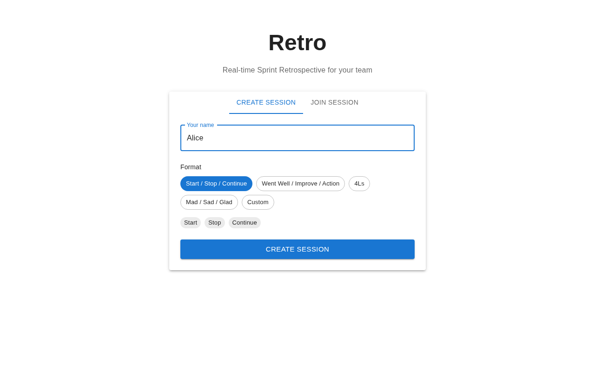
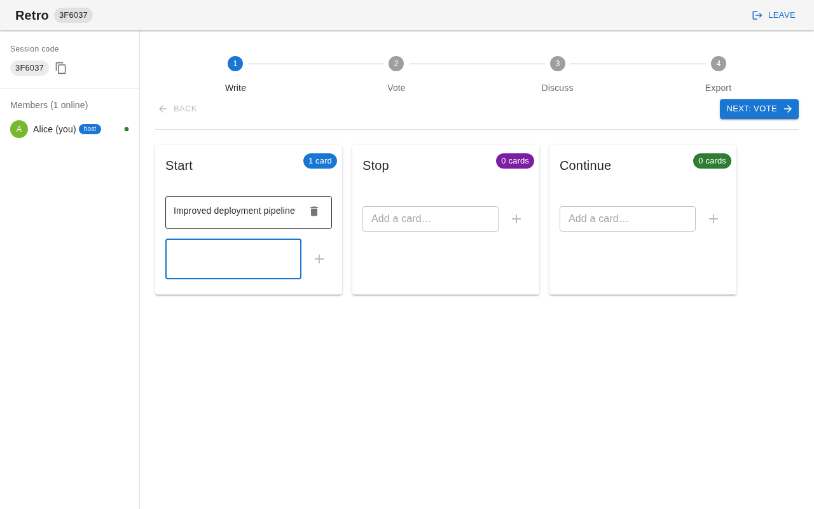
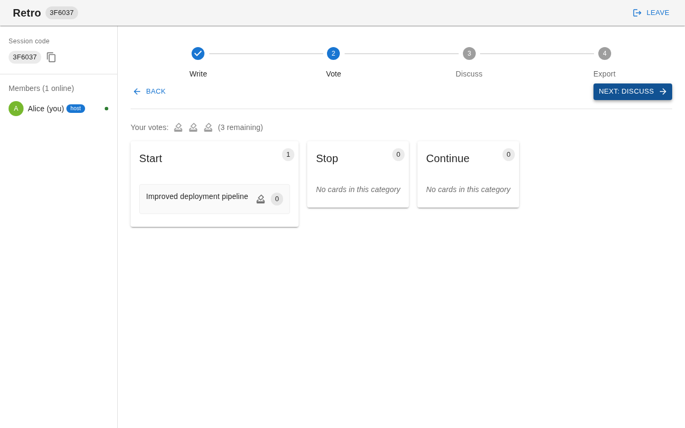
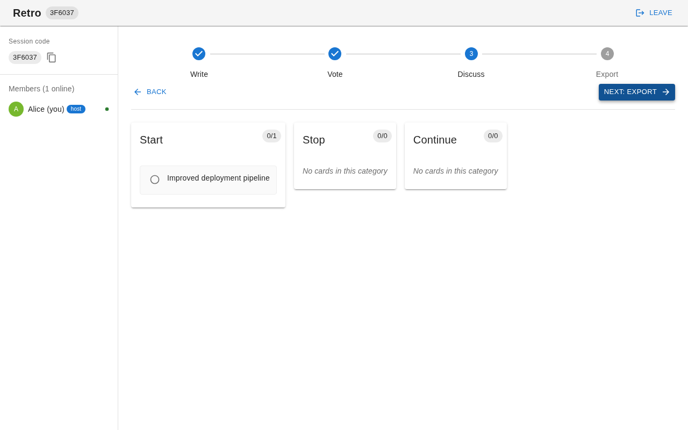
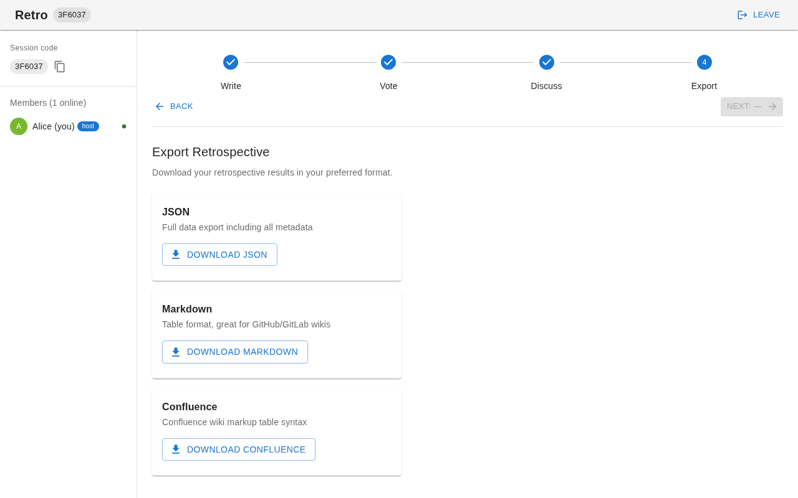
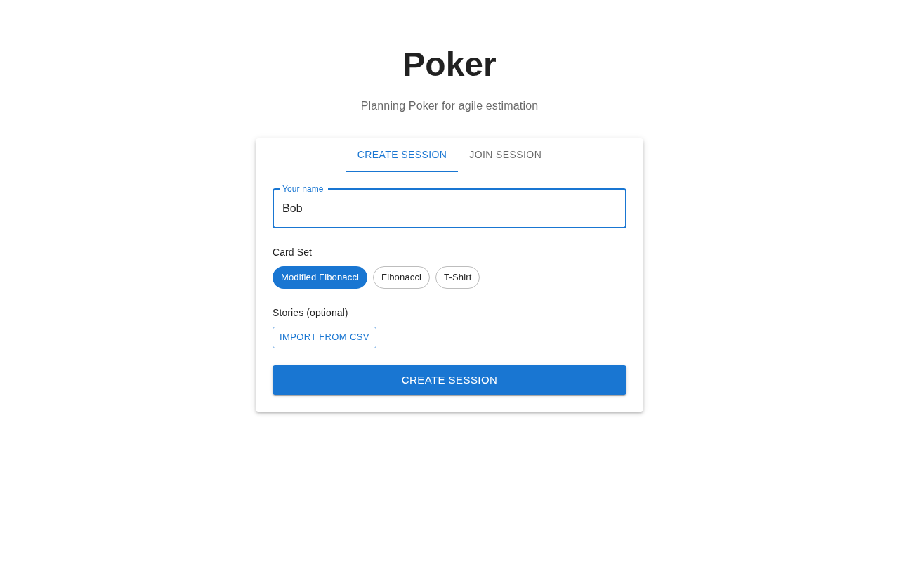
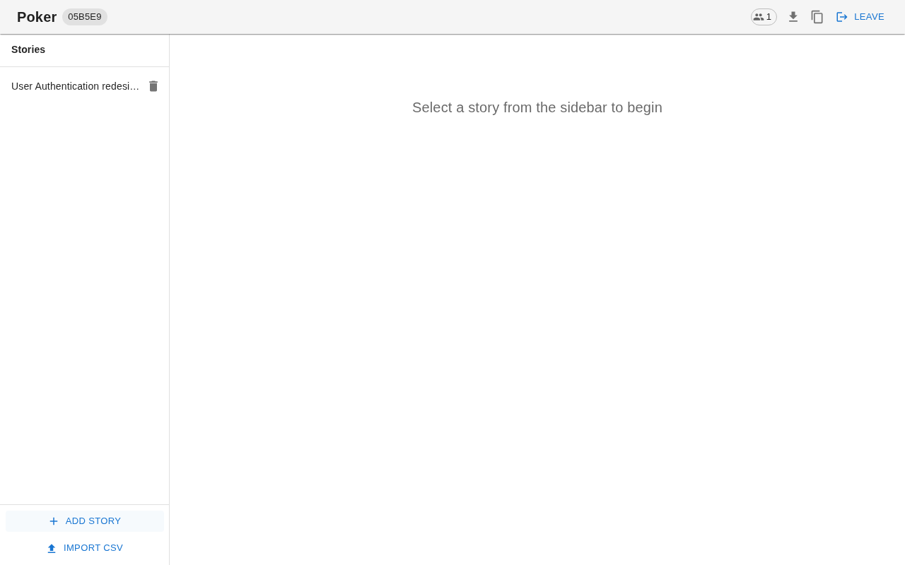
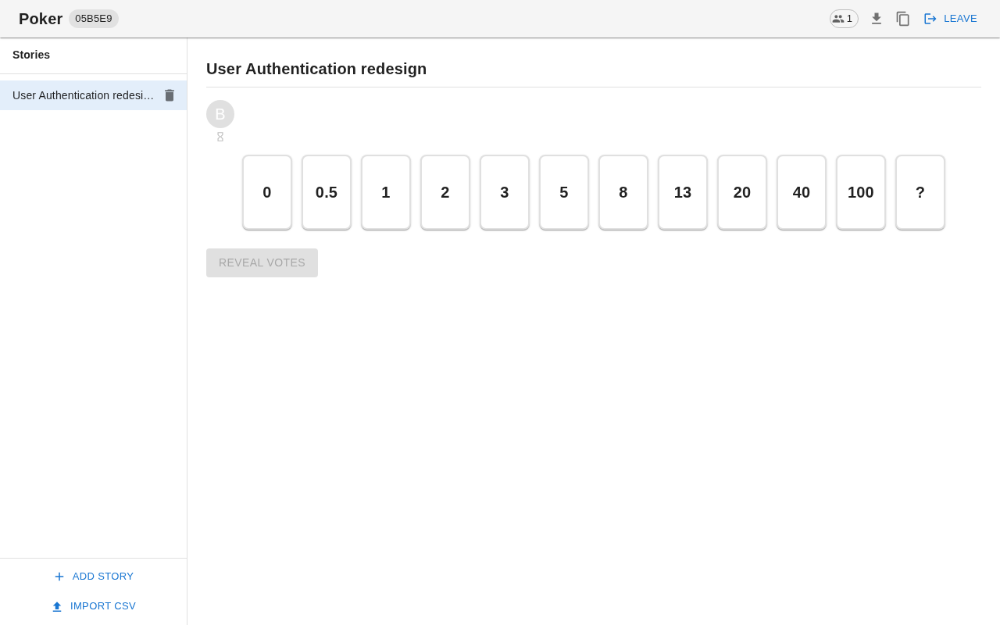
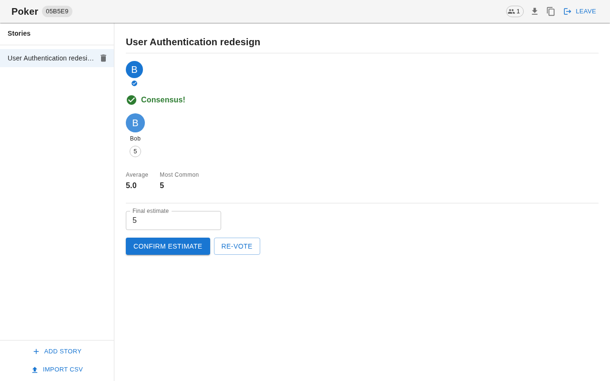
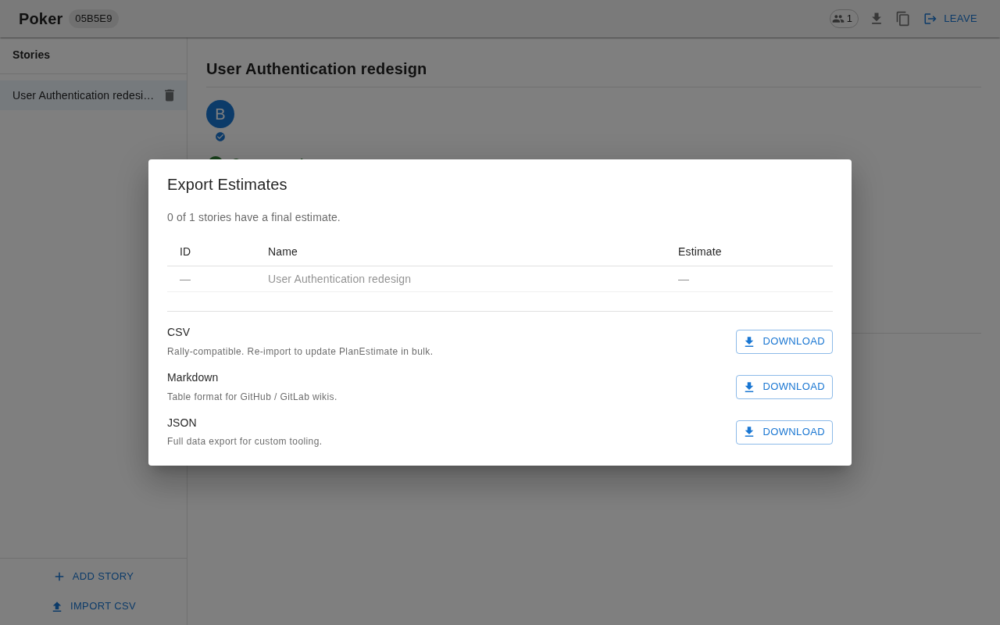

# Team Tools

Real-time collaborative tools for agile teams — Sprint Retrospective and Planning Poker, running in the browser with no accounts required.

## Table of Contents

- [What is it](#what-is-it)
- [Why use it](#why-use-it)
- [How to Use](#how-to-use)
  - [Retro](#retro)
  - [Poker](#poker)
- [Getting Started](#getting-started)
  - [Prerequisites](#prerequisites)
  - [Installation](#installation)
  - [Environment variables](#environment-variables)
  - [Running locally](#running-locally)
- [Deployment](#deployment)

---

## What is it

A single-page React application that hosts two tools:

- **Retro** — facilitates sprint retrospectives with structured phases (Write → Vote → Discuss → Export). Team members add cards to configurable categories, dot-vote anonymously, then discuss top items and export the results.
- **Poker** — facilitates agile story-point estimation via Planning Poker. The host imports a backlog (or adds stories manually), the team votes with playing cards, and the host confirms final estimates that can be exported back to a Rally-compatible CSV.

All collaboration is real-time via Firebase Realtime Database. No sign-up, no accounts — just share a session link or code.

## Why use it

- **Zero friction** — join a session with a name and a code, nothing else.
- **Real-time sync** — all participants see updates instantly; presence tracking shows who is online.
- **Host-resilient** — if the host disconnects, the longest-tenured online member is automatically promoted.
- **Rally-compatible export** — import stories from a Rally CSV export and export estimates back in the same format.
- **Self-hostable** — bring your own Firebase project; the app is a static build deployable anywhere.

## How to Use

### Retro

**1. Create a session** — enter your name, pick a format, click *Create Session*.



**2. Write phase** — everyone adds cards to each category.



**3. Vote phase** — cards are revealed; dot-vote on what matters most.



**4. Discuss phase** — cards sorted by votes; team discusses top items.



**5. Export** — download as JSON, Markdown, or Confluence markup.



> The host controls phase transitions. If the host disconnects, the longest-tenured online member is automatically promoted.

---

### Poker

**1. Create a session** — choose a card set, optionally import a Rally CSV, click *Create Session*.



**2. Add stories** — use *Add Story* or *Import CSV* in the sidebar.



**3. Vote** — the host selects a story; everyone picks a card. Checkmarks show who has voted without revealing values.



**4. Reveal & confirm** — host clicks *Reveal Votes*, then sets the final estimate.



**5. Export** — download all estimates as Rally-compatible CSV, Markdown, or JSON at any time.



#### Importing stories from Rally

Export your backlog from Rally as CSV (`FormattedID`, `Name`, `Description`, `PlanEstimate`). Drag the file into the import dialog — existing estimates are pre-filled. Rally's HTML description field is rendered correctly in the session view.

## Getting Started

### Prerequisites

- Node.js 18+
- A [Firebase](https://firebase.google.com/) project with **Realtime Database** enabled

### Installation

```bash
git clone <repo-url>
cd retro-app
npm install
```

### Environment variables

```bash
cp .env.example .env
```

Edit `.env` and fill in your Firebase project values:

```
VITE_FIREBASE_API_KEY=
VITE_FIREBASE_AUTH_DOMAIN=
VITE_FIREBASE_DATABASE_URL=
VITE_FIREBASE_PROJECT_ID=
VITE_FIREBASE_STORAGE_BUCKET=
VITE_FIREBASE_MESSAGING_SENDER_ID=
VITE_FIREBASE_APP_ID=
```

### Running locally

```bash
npm run dev      # http://localhost:5173
npm run build    # production build → dist/
npm run preview  # serve dist/ locally
npm run lint     # ESLint
```

## Deployment

The app is a static build. Any static host works. For Netlify, `netlify.toml` already includes the catch-all redirect required for client-side routing:

```toml
[[redirects]]
  from = "/*"
  to = "/index.html"
  status = 200
```

Set the `VITE_FIREBASE_*` environment variables in your hosting provider's dashboard — do **not** commit `.env`.
